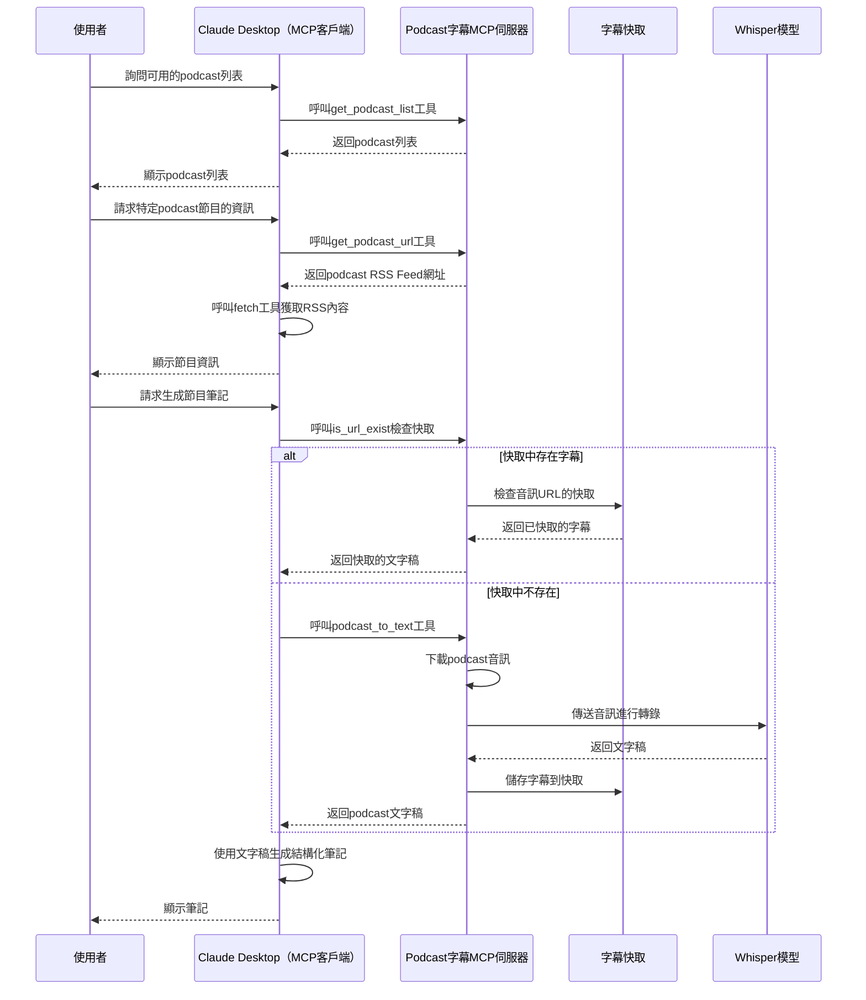

大家是不是也會像我一樣：在通勤路上、跑步時、或是在睡前，會打開 Podcast 聽聽些什麼？

這些 Podcast 裡常常有一些超棒的想法、感動的故事和知識點，聽的時候還會想：

* 「哇，這觀點真的很讚！」
    
* 「嗯，這個故事我要記起來下次分享給別人！」
    
* 「對耶，這個作法我下次也要來如法炮製！」
    

問題來了...

過幾天後，腦中只剩下「那集好像講了什麼很有趣的東西」，但具體是什麼？完全想不起來了！

為什麼會這樣？因為我們只做到「聽」，卻沒有「記下來」和「之後再回顧」。

但誰有那麼多時間又聽又做筆記啊？能擠出時間聽就不錯了！

現在有個超實用的解法：用AI幫你做這件事！

我們可以用這些工具一起工作：

* Whisper 技術：自動把節目內容變成文字
    
* Claude AI：幫你整理重點、做成有條理的筆記
    

這樣做有什麼好處？

1. 不用自己手動做筆記，省時間
    
2. 重要想法不會就此消失
    
3. 隨時可以翻出來重溫或深入思考
    

簡單說，就是用 AI 幫你記錄 Podcast 的好點子，不再「聽過就忘」

---

# 使用範例


## 步驟

1. 在 Claude Desktop 聊天界面輸入提問(以下是範例, 可以自由提問)
    
    * 有哪些 podcast?
        
    * 大人的 Small Talk 的最新節目是什麼?
        
    * 請給我大人的 Small Talk 的節目 EP564 的筆記
        
2. 系統會自動：
    
    * 提供已經登錄的播客介紹
        
    * 提供播客最新的節目清單(當然也包含之前的節目)
        
    * 提供指定的節目的筆記
        
        * 檢查是否已有快取的音訊檔案
            
        * 如果沒有，會下載 podcast 音訊
            
        * 使用 Whisper 轉換為文字稿
            
        * 透過 Claude 整理成結構化筆記
            

幾分鐘後，你就能得到一份結構清晰、段落分明的筆記！

## 用法技巧

### 還沒聽的 Podcast

1. 我會先讓 Claude 產生筆記
    
2. 如果內容我有興趣再收聽
    
3. 收聽完節目後, 如果有需要記筆記, 再將筆記貼到 Obsidian 筆記裡
    

### 聽過的 Podcast 想記筆記

1. 指定節目(或提供音檔的 URL)要求 Claude 產生筆記
    
2. 再將筆記貼到 Obsidian 筆記裡
    

---

# 工作流程圖



---

# 安裝與設定步驟

## 前置需求

在開始建立這個自動化筆記系統前，你需要準備以下項目：

1. **Python 3.10 或更高版本**：用於運行 MCP 伺服器與 Whisper
    
2. **安裝設定好 Fetch MCP Server:** 可以參考我之前的文章 [讓 Claude Desktop 連上網路](https://polly.hashnode.dev/claude-mcp-fetch)
    

## 安裝

### **步驟 1：安裝 uv 工具**

#### Windows

```powershell
powershell -ExecutionPolicy ByPass -c "irm https://astral.sh/uv/install.ps1 | iex"
```

請重新啟動終端機以確保 uv 命令可被識別。

### **步驟 2：安裝 ffmpeg工具**

#### Windows

```powershell
choco install ffmpeg
```

如果沒有choco, 建議使用 chocolatey

#### Windows

```powershell
Set-ExecutionPolicy Bypass -Scope Process -Force; [System.Net.ServicePointManager]::SecurityProtocol = [System.Net.ServicePointManager]::SecurityProtocol -bor 3072; iex ((New-Object System.Net.WebClient).DownloadString('https://community.chocolatey.org/install.ps1'))
```

## **建立專案結構**

#### Windows

```powershell
# 建立新專案目錄
uv init podcast_to_text
cd podcast_to_text

# 建立虛擬環境並啟用
uv venv
.venv\Scripts\activate

# 安裝依賴套件
uv add mcp[cli] openai-whisper
# 安裝 PyTorch (如果遇到依賴問題)
uv add markupsafe==2.1.5 torch torchvision torchaudio --index-url https://download.pytorch.org/whl/cu121

# 建立伺服器檔案
new-item podcast_feeds.json
new-item podcast_to_text.py
```

## 建立播客 RSS Feed 清單

在 podcast\_feeds.json 檔案，登錄 RSS Feed URL：

```json
{
  "feeds": {
    "股癌": {
      "url": "https://feeds.soundon.fm/podcasts/954689a5-3096-43a4-a80b-7810b219cef3.xml",
      "description": "Gooaye 股癌播客 - 晦澀金融投資知識直白講，重要海內外時事輕鬆談"
    },
    "大人的 Small Talk": {
      "url": "https://feeds.soundon.fm/podcasts/6731d283-54f0-49ec-a040-e5a641c3125f.xml",
      "description": "職涯發展｜人際溝通｜個人成長｜商業管理｜兩性關係 姚詩豪(Bryan)與張國洋(Joe)兩位管理顧問，和你分享「成為成熟大人」的必備學問。"
    }
  }
}
```

## 建立 MCP 伺服器主程式

在 podcast\_to\_text.py 檔案，實作我們的自動化筆記系統：

```python
import os
import json
import whisper
import tempfile
import torch
import logging
import time
import urllib.request
import hashlib
from typing import List, Dict, Any, Optional
from mcp.server.fastmcp import FastMCP

# 設定日誌配置
logging.basicConfig(
    level=logging.INFO,
    format='%(asctime)s - %(levelname)s - %(message)s'
)
logger = logging.getLogger("podcast_to_text")

# 初始化 FastMCP 伺服器
mcp = FastMCP("podcast_to_text")

# 設定基本參數
WHISPER_MODEL_SIZE = "tiny"  # 可選擇: tiny, base, small, medium, large
DEVICE = "cuda" if torch.cuda.is_available() else "cpu"
CACHE_DIR = "podcasts_cache"  # 快取目錄
FEEDS_FILE = "podcast_feeds.json"  # Podcast RSS feeds 設定檔案
SUPPORTED_LANGUAGES = ["zh-TW", "en", "zh", "ja"]  # 支援的語言

# 創建必要的目錄
os.makedirs(CACHE_DIR, exist_ok=True)

# 格式化時間戳記
def format_timestamp(seconds: float) -> str:
    """將秒數格式化為 [MM:SS] 格式"""
    minutes = int(seconds // 60)
    remaining_seconds = int(seconds % 60)
    return f"[{minutes:02d}:{remaining_seconds:02d}]"

# 處理快取相關操作
def get_cache_file_path(url: str, language: str) -> str:
    """取得快取檔案路徑"""
    cache_filename = hashlib.md5(url.encode()).hexdigest()
    return os.path.join(CACHE_DIR, f"{cache_filename}_{language}.json")

def read_from_cache(cache_file: str, url: str) -> Optional[Dict]:
    """從快取讀取資料"""
    try:
        if os.path.exists(cache_file):
            with open(cache_file, 'r', encoding='utf-8') as f:
                cached_data = json.load(f)
            
            if cached_data.get("original_url") == url:
                logger.info(f"從快取檔案獲取轉錄 (URL: {url})")
                return cached_data
            else:
                logger.warning(f"快取URL不匹配，重新生成轉錄")
    except Exception as e:
        logger.warning(f"讀取快取失敗: {str(e)}")
    
    return None

def save_to_cache(cache_file: str, transcript: str, url: str) -> bool:
    """保存資料到快取"""
    try:
        with open(cache_file, 'w', encoding='utf-8') as f:
            json.dump({
                "transcript": transcript,
                "original_url": url
            }, f, ensure_ascii=False, indent=2)
        logger.info("轉錄已儲存到快取")
        return True
    except Exception as e:
        logger.warning(f"儲存快取失敗: {str(e)}")
        return False

# 下載播客音訊
def download_audio(url: str, output_path: str, timeout: int = 300) -> tuple[bool, float]:
    """下載播客的音訊檔案"""
    start_time = time.time()
    try:
        logger.info(f"正在下載音訊: {url}")
        
        # 建立 HTTP 請求
        request = urllib.request.Request(
            url,
            headers={
                'User-Agent': 'Mozilla/5.0 (Windows NT 10.0; Win64; x64) AppleWebKit/537.36'
            }
        )
        
        # 下載檔案
        with urllib.request.urlopen(request, timeout=timeout) as response:
            with open(output_path, 'wb') as out_file:
                out_file.write(response.read())
        
        download_time = time.time() - start_time
        
        if os.path.exists(output_path):
            file_size = os.path.getsize(output_path)
            logger.info(f"音訊下載成功，檔案大小: {file_size / (1024*1024):.2f} MB，用時: {download_time:.2f}秒")
            return True, download_time
        else:
            logger.warning("下載似乎成功，但找不到輸出檔案")
            return False, download_time
    except Exception as e:
        logger.error(f"下載音訊時出錯: {str(e)}")
        return False, time.time() - start_time

# 使用 Whisper 處理音訊
def process_audio_with_whisper(audio_file: str, language: str = "zh-TW") -> Optional[Dict[str, Any]]:
    """使用 Whisper 模型處理音訊檔案並生成字幕"""
    try:
        # 載入 Whisper 模型
        logger.info(f"正在載入 Whisper {WHISPER_MODEL_SIZE} 模型")
        model = whisper.load_model(WHISPER_MODEL_SIZE, device=DEVICE)
        
        # 設定轉錄選項
        task_type = "translate" if language.startswith("en") else "transcribe"
        transcribe_options = {
            "language": language[:2] if language else None,
            "task": task_type,
        }
        
        # 開始轉錄
        start_time = time.time()
        logger.info(f"開始轉錄音訊 (語言: {language[:2]}, 任務: {task_type})")
        result = model.transcribe(audio_file, **transcribe_options)
        transcribe_time = time.time() - start_time
        
        # 格式化字幕結果
        formatted_text = f"【字幕來源: Whisper {WHISPER_MODEL_SIZE} 模型 (語言: {language})】\n"
        formatted_text += f"【運行設備: {DEVICE}】\n"
        formatted_text += f"【轉錄用時: {transcribe_time:.2f} 秒】\n\n"
        
        for segment in result["segments"]:
            timestamp = format_timestamp(segment["start"])
            formatted_text += f"{timestamp} {segment['text'].strip()}\n"
        
        logger.info(f"音訊轉錄完成，用時: {transcribe_time:.2f} 秒")
        
        return {
            "text": formatted_text,
            "transcribe_time": transcribe_time,
            "device": DEVICE
        }
    
    except Exception as e:
        logger.error(f"使用 Whisper 處理音訊時出錯: {str(e)}")
        return None

@mcp.tool()
async def podcast_to_text(
    url: str,
    language: str = "zh-TW",
    cache_enabled: bool = True
) -> List[Dict[str, Any]]:
    """將 Podcast 轉文字
    
    Args:
        url: 音檔的直接URL
        language: 轉錄語言代碼，預設為 'zh-TW'（繁體中文）
        cache_enabled: 是否啟用轉錄快取
    
    Returns:
        包含處理結果和轉錄內容的列表
    """
    try:
        # 設定快取檔案路徑
        cache_file = get_cache_file_path(url, language)
        
        # 檢查快取
        if cache_enabled:
            cached_data = read_from_cache(cache_file, url)
            if cached_data:
                return [
                    {"status": "success", "message": f"已從快取檔案獲取轉錄", "source": "cache_file"},
                    f"【轉錄來源: 快取檔案】\n【音頻URL: {url}】\n\n{cached_data['transcript']}"
                ]
        
        # 建立臨時目錄進行處理
        with tempfile.TemporaryDirectory() as temp_dir:
            # 設定音訊檔案路徑
            audio_path = os.path.join(temp_dir, f"{hashlib.md5(url.encode()).hexdigest()}.mp3")
            
            # 下載音訊
            download_success, download_time = download_audio(url, audio_path)
            
            if not download_success:
                return [{"status": "error", "message": "下載音訊失敗"}]
            
            # 確認音訊檔案是否存在
            if not os.path.exists(audio_path):
                return [{"status": "error", "message": "找不到下載的音訊檔案"}]
            
            # 使用 Whisper 處理音訊
            result = process_audio_with_whisper(audio_path, language)
            
            if not result:
                return [{"status": "error", "message": "使用 Whisper 處理音訊時出錯"}]
            
            # 獲取處理結果
            whisper_transcript = result["text"]
            transcribe_time = result.get("transcribe_time", 0)
            
            # 儲存到快取
            if cache_enabled:
                save_to_cache(cache_file, whisper_transcript, url)
            
            # 生成回傳資訊
            formatted_output = f"【轉錄來源: Whisper {WHISPER_MODEL_SIZE}】\n"
            formatted_output += f"【音頻URL: {url}】\n\n"
            formatted_output += whisper_transcript
            
            # 回傳結果
            return [
                {
                    "status": "success", 
                    "message": f"已成功轉錄音頻", 
                    "source": "whisper",
                    "download_time": download_time,
                    "transcribe_time": transcribe_time,
                    "device": DEVICE
                },
                formatted_output
            ]
    
    except Exception as e:
        logger.error(f"處理音頻URL時出錯: {str(e)}")
        return [{"status": "error", "message": f"處理音頻URL時出錯: {str(e)}"}]

@mcp.tool()
async def is_url_exist(url: str) -> List[Dict[str, Any]]:
    """確認URL是否已快取
    
    Args:
        url: 要檢查的URL
    
    Returns:
        包含檢查結果的列表
    """
    # 檢查是否有對應的快取檔案
    for lang in SUPPORTED_LANGUAGES:
        cache_file = get_cache_file_path(url, lang)
        cached_data = read_from_cache(cache_file, url)
        if cached_data:
            return [{"status": "info", "message": f"此URL已有快取檔案 (語言: {lang})", "exists": True}]
    
    return [{"status": "info", "message": "此URL尚未有快取檔案", "exists": False}]

def load_podcast_data() -> Optional[Dict]:
    """載入播客資料檔案"""
    try:
        if not os.path.exists(FEEDS_FILE):
            logger.error(f"找不到播客設定檔案: {FEEDS_FILE}")
            return None
        
        with open(FEEDS_FILE, 'r', encoding='utf-8') as f:
            podcast_data = json.load(f)
        
        if 'feeds' not in podcast_data:
            logger.error(f"播客設定檔案格式錯誤: 缺少 'feeds' 欄位")
            return None
            
        return podcast_data
    except Exception as e:
        logger.error(f"載入播客資料時出錯: {str(e)}")
        return None

@mcp.tool()
async def get_podcast_url(podcast_name: str) -> List[Dict[str, Any]]:
    """取得 podcast 的 URL
    
    Args:
        podcast_name: 播客名稱
    
    Returns:
        包含播客 RSS feed URL 的列表
    """
    podcast_data = load_podcast_data()
    if not podcast_data:
        return [{"status": "error", "message": "無法載入播客資料"}]
    
    if podcast_name not in podcast_data['feeds']:
        # 列出所有可用的播客名稱
        available_podcasts = list(podcast_data['feeds'].keys())
        return [
            {"status": "error", "message": f"找不到名為 '{podcast_name}' 的播客設定"},
            f"可用的播客名稱: {', '.join(available_podcasts)}"
        ]
    
    # 取得播客 URL
    podcast_info = podcast_data['feeds'][podcast_name]
    return [
        {"status": "success", "message": f"已取得播客 URL", "url": podcast_info['url']},
        podcast_info
    ]

@mcp.tool()
async def get_podcast_list() -> List[Dict[str, Any]]:
    """取得所有可用的播客列表
    
    Returns:
        包含所有可用播客名稱和資訊的列表
    """
    podcast_data = load_podcast_data()
    if not podcast_data:
        return [{"status": "error", "message": "無法載入播客資料"}]
    
    # 取得所有播客名稱
    podcast_names = list(podcast_data['feeds'].keys())
    
    # 如果沒有播客
    if not podcast_names:
        return [{"status": "info", "message": "目前沒有任何播客設定"}]
    
    # 取得每個播客的詳細資訊
    podcasts_info = {name: podcast_data['feeds'][name] for name in podcast_names}
    
    return [
        {"status": "success", "message": f"成功取得播客列表", "count": len(podcast_names)},
        {
            "podcast_names": podcast_names,
            "podcasts_info": podcasts_info
        }
    ]
    
# 主程式入口點
if __name__ == "__main__":
    logger.info(f"播客轉文字服務啟動中，運行設備: {DEVICE}")
    logger.info(f"使用 FastMCP 伺服器啟動 API 服務...")
    # 使用標準輸入/輸出作為通訊通道
    mcp.run(transport="stdio")
```

運行 uv run podcast\_to\_text.py 以確認一切正常運作。

## 設定 Claude Desktop 配置

#### **Windows**

設定檔通常位於以下路徑：

```powershell
C:\Users\[使用者名稱]\AppData\Roaming\Claude\claude_desktop_config.json
```

```json
{
    "mcpServers": {   
        "fetch": {
            "command": "uvx",
            "args": [
                "mcp-server-fetch"
            ]
        },
        "podcast_to_text": {
            "command": "uv",
            "args": [
                "--directory",
                "C:\\[專案路徑]\\podcast_to_text",
                "run",
                "podcast_to_text.py"
            ]
        }
    }
}
```

重新啟動 Claude Desktop，即可在聊天界面中使用我們的自動化筆記功能！

### **設定成功會出現以下內容**


## 設定 Claude Projects **instructions**

我習慣用專案, 就不用每次都要下長長的提示詞, 以下是我專案先維護好的提示詞:

```plaintext

<我會提供什麼, 範例1>
	有哪些podcast?
	
	<取得podcast的步驟>
		<步驟1>
			呼叫 podcast_to_text get_podcast_list 取得<podcast>
		</步驟1>
	</取得podcast的步驟>	
	<podcast>
		以下為範例
		- 「股癌」
		- 「大人的 Small Talk」
	</podcast>
</我會提供什麼, 範例1>

<我會提供什麼, 範例2>
	股癌的最新節目是什麼?
	
	<取得最新節目資訊的步驟>
		<步驟1>
			呼叫 podcast_to_text get_podcast_url 取得<podcast的RSS FEED>
		</步驟1>
		<步驟2>
			呼叫 fetch 取得 <最新節目資訊>
		</步驟2>
	</取得最新節目資訊的步驟>
	<podcast的RSS FEED>
		以下為範例
		https://feeds.soundon.fm/podcasts/954689a5-3096-43a4-a80b-7810b219cef3.xml
	</podcast的RSS FEED>
	
	<最新節目資訊>
		以下為範例
		EP553
		- 發布日期：2025年4月30日（星期三）
		- 標題：逐漸發酵
		- 節目簡介： 一年一度的母親節又來了  
		    你準備好老婆、岳母、媽媽的母親節禮物了嗎？  
		    別再亂買香水包包了，這次直接送會「發光」的保養品才是王道！
		- 音檔下載 url
			https://rss.soundon.fm/rssf/954689a5-3096-43a4-a80b-7810b219cef3/feedurl/cfec7721-b0f0-4b0a-8b7b-0c5d11c1ece9/rssFileVip.mp3
		- 音檔時長：50分鐘
	</最新節目資訊>
</我會提供什麼, 範例2>


<我會提供什麼, 範例3>
	請給我股癌的節目EP553的筆記

	<取得節目筆記的步驟>
		<步驟1>
			呼叫 podcast_to_text is_url_exist 確認<最新節目資訊>的<文字稿>是否已存在
			如果不存在, 執行<步驟2>
			如果已存在, 執行<步驟3>
		</步驟1>
		<步驟2>		
			呼叫 podcast_to_text podcast_to_text 獲取<文字稿>
			<角色扮演>將<文字稿>轉化成<筆記>
			<筆記>的來源只有<文字稿>, 不要添加非<文字稿>的內容
		</步驟2>	
		<步驟3>
			直接使用已經存在的<文字稿>轉化成<筆記>
			<筆記>的來源只有<文字稿>, 不要添加非<文字稿>的內容
		</步驟3>
	</取得節目筆記的步驟>
	<角色扮演>
		一個有10年經驗的編輯, 善於將雜亂的知識, 去蕪存菁, 改寫成結構完整、段落分明、條理清晰、圖文並茂、高標準、高品質的文章
		如果是觀念, 請使用淺白、專業的描述
		如果是需要實際的練習的內容, 請設計成簡單的操作步驟
	</角色扮演>	
	<筆記>
		請使用正體中文
		如果是複雜的邏輯, 請繪製SVG/MERMAID(時序圖優先)說明
		如果是比較的內容,請設計成表格
		因為我會一邊聽節目一邊微調筆記, 請儘量維持整理出來的筆記與文字稿順序一致
		筆記不是只是節錄重點, 而是要完整記錄, 但是以整理過的方式呈現
	</筆記>	
	<文字稿>
		以下為範例
		3d3a2c68-b7d1-426e-87b5-0a8beeb3c568_zh-TW.json
	</文字稿>	
</我會提供什麼, 範例3>
```

---

# 限制

* 需要先查到播客公開的 RSS Feed URL, 如果播客沒有提供公開的 RSS Feed URL, 就無法使用
    
    (如果有音檔的 URL, podcast\_to\_text 工具也是可以產生筆記的)
    

---

# 參考資料

1. [Model Context Protocol 快速入門指南](https://modelcontextprotocol.io/quickstart/server)
    
2. [OpenAI Whisper GitHub 儲存庫](https://github.com/openai/whisper)
    
3. [**FFmpeg GitHub 儲存庫**](https://github.com/FFmpeg/FFmpeg)