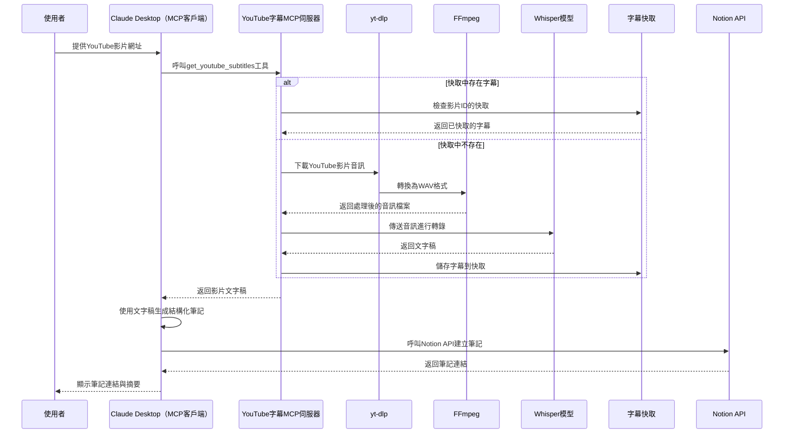

在這個AI技術迅速迭代的時代，我們每天都在消化大量的影片內容來學習新知識。

但你是否曾有這樣的經驗：花了大量時間觀看各種教學影片，卻在一段時間後發現自己似乎沒有真正成長？

問題可能出在我們缺少了「做筆記」和「複盤」這兩個關鍵步驟。

然而，現實是：

> 「已經花那麼多時間看影片了，哪有額外時間再做筆記啊？」😩

最近我發現可以善用AI技術來幫我做筆記！這樣不僅節省時間，還能有系統地累積知識，方便日後複盤回顧。

本文將介紹一個結合 Whisper 語音識別技術、Claude AI 與 Notion 的自動化工作流程，讓你能夠：

1. 自動將 YouTube 影片轉換為文字稿
    
2. 利用 AI 整理並生成結構化筆記
    
3. 直接將筆記存入 Notion 知識庫
    
4. 隨時回顧並鞏固所學知識
    

這個自動化筆記系統不僅能節省大量時間，還能幫助你建立系統性的知識累積機制，讓每次觀看的影片內容都能轉化為長期記憶中的寶貴資產。

---

# 使用範例


## 步驟

1. 複製 YouTube 影片網址
    
2. 在 Claude Desktop 聊天界面貼上 YouTube 影片網址
    
3. 系統會自動：
    
    * 下載影片音訊
        
    * 使用 Whisper 轉換為文字稿
        
    * 透過 Claude 整理成結構化筆記
        
    * 將筆記儲存至你的 Notion 資料庫
        

幾分鐘後，你就能得到一份結構清晰、段落分明的筆記！

## 用法技巧

1. 我通常會先讓 Claude 產生筆記
    
2. 在閱讀影片的同時, 一邊修改筆記
    
3. 閱讀完影片後, 再將筆記貼到 Notion 筆記裡
    

---

# 工作流程圖



---

# 安裝與設定步驟

## 前置需求

在開始建立這個自動化筆記系統前，你需要準備以下項目：

1. **Python 3.10 或更高版本**：用於運行 MCP 伺服器與 Whisper
    
2. **安裝設定好 Notion MCP Server:** 可以參考我之前的文章 [讓 Claude Desktop 幫你整理你的 Notion 筆記](https://polly.hashnode.dev/claude-desktop-notion)
    

## 安裝

### **步驟 1：安裝 uv 工具**

#### Windows

```powershell
powershell -ExecutionPolicy ByPass -c "irm https://astral.sh/uv/install.ps1 | iex"
```

請重新啟動終端機以確保 uv 命令可被識別。

### **步驟 2：安裝 ffmpeg工具**

#### Windows

```powershell
choco install ffmpeg
```

如果沒有choco, 建議使用 chocolatey

#### Windows

```powershell
Set-ExecutionPolicy Bypass -Scope Process -Force; [System.Net.ServicePointManager]::SecurityProtocol = [System.Net.ServicePointManager]::SecurityProtocol -bor 3072; iex ((New-Object System.Net.WebClient).DownloadString('https://community.chocolatey.org/install.ps1'))
```

## **建立專案結構**

#### Windows

```powershell
# 建立新專案目錄
uv init youtube_to_text
cd youtube_to_text

# 建立虛擬環境並啟用
uv venv
.venv\Scripts\activate

# 安裝依賴套件
uv add mcp[cli] openai-whisper yt-dlp
# 我這裡遇到依賴問題, 解法是清空 pyproject.toml 的 dependencies 後, 再安裝 PyTorch
uv add markupsafe==2.1.5 torch torchvision torchaudio --index-url https://download.pytorch.org/whl/cu121

# 建立伺服器檔案
new-item youtube_to_text.py
```

## 建立 MCP 伺服器主程式

在 youtube\_to\_text.py 檔案，實作我們的自動化筆記系統：

```python
import os
import re
import json
import whisper
import tempfile
import subprocess
import torch
import logging
import time
from typing import List, Optional, Dict, Any
from mcp.server.fastmcp import FastMCP

# 設定日誌配置
logging.basicConfig(
    level=logging.INFO,
    format='%(asctime)s - %(levelname)s - %(message)s'
)
logger = logging.getLogger("youtube_to_text")

# 初始化 FastMCP 伺服器
mcp = FastMCP("youtube_to_text")

# 設定基本參數
WHISPER_MODEL_SIZE = "tiny"  # 可選擇: tiny, base, small, medium, large
DEVICE = "cuda" if torch.cuda.is_available() else "cpu"

# 擷取 YouTube 影片 ID 的函數
def extract_youtube_id(url: str) -> Optional[str]:
    """從 YouTube URL 中擷取影片 ID"""
    patterns = [
        r"youtube\.com/watch\?v=([^&\s]+)",  # 標準 YouTube URL
        r"youtu\.be/([^\?\s]+)",             # 縮短的 YouTube URL
        r"youtube\.com/embed/([^\?\s]+)",    # 嵌入式 YouTube URL
        r"youtube\.com/v/([^\?\s]+)",        # 舊格式 YouTube URL
        r"^([a-zA-Z0-9_-]{11})$"             # 直接輸入 YouTube ID
    ]

    for pattern in patterns:
        match = re.search(pattern, url)
        if match:
            return match.group(1)
    return None

# 格式化時間戳記
def format_timestamp(seconds: float) -> str:
    """將秒數格式化為 [MM:SS] 格式"""
    minutes = int(seconds // 60)
    remaining_seconds = int(seconds % 60)
    return f"[{minutes:02d}:{remaining_seconds:02d}]"

# 使用 yt-dlp 下載 YouTube 音訊
def download_youtube_audio(url: str, output_path: str, timeout: int = 300) -> bool:
    """使用 yt-dlp 下載 YouTube 影片的音訊"""
    try:
        ytdlp_cmd = [
            "yt-dlp", 
            "--extract-audio", 
            "--audio-format", "wav",
            "--audio-quality", "0",
            "--output", output_path,
            url
        ]
        logger.info("執行 yt-dlp 命令下載音訊")
        
        process = subprocess.run(ytdlp_cmd, check=True, timeout=timeout,
                               stdout=subprocess.PIPE, stderr=subprocess.PIPE)
        
        if os.path.exists(output_path):
            logger.info("音訊下載成功")
            return True
        else:
            logger.warning("下載似乎成功，但找不到輸出檔案")
            return False
    except Exception as e:
        logger.error(f"下載音訊時出錯: {str(e)}")
        return False

# 使用 Whisper 處理音訊
def process_audio_with_whisper(audio_file: str, language: str = "zh-TW") -> Optional[Dict[str, Any]]:
    """使用 Whisper 模型處理音訊檔案並生成字幕"""
    try:
        # 載入 Whisper 模型
        logger.info(f"正在載入 Whisper {WHISPER_MODEL_SIZE} 模型")
        model = whisper.load_model(WHISPER_MODEL_SIZE, device=DEVICE)
        
        # 設定轉錄選項
        task_type = "translate" if language.startswith("en") else "transcribe"
        transcribe_options = {
            "language": language[:2] if language else None,
            "task": task_type,
        }
        
        # 開始計時
        start_time = time.time()
        
        # 轉錄音訊
        logger.info(f"開始轉錄音訊 (語言: {language[:2]}, 任務: {task_type})")
        result = model.transcribe(audio_file, **transcribe_options)
        
        # 結束計時
        end_time = time.time()
        transcribe_time = end_time - start_time
        
        # 格式化字幕結果
        formatted_text = f"【字幕來源: Whisper {WHISPER_MODEL_SIZE} 模型 (語言: {language})】\n"
        formatted_text += f"【運行設備: {DEVICE}】\n"
        formatted_text += f"【轉錄用時: {transcribe_time:.2f} 秒】\n\n"
        
        for segment in result["segments"]:
            timestamp = format_timestamp(segment["start"])
            formatted_text += f"{timestamp} {segment['text'].strip()}\n"
        
        logger.info(f"音訊轉錄完成，用時: {transcribe_time:.2f} 秒")
        
        return {
            "text": formatted_text,
            "transcribe_time": transcribe_time,
            "device": DEVICE
        }
    
    except Exception as e:
        logger.error(f"使用 Whisper 處理音訊時出錯: {str(e)}")
        return None

# 使用 FastMCP 裝飾器來定義 API 端點
@mcp.tool()
async def get_youtube_subtitles(
    url: str,
    language: str = "zh-TW",
    cache_enabled: bool = True
) -> List[Dict[str, Any]]:
    """擷取 YouTube 影片的字幕，使用 yt-dlp + Whisper
    
    Args:
        url: YouTube 影片的網址
        language: 字幕語言代碼，預設為 'zh-TW'（繁體中文）
        cache_enabled: 是否啟用字幕快取
    
    Returns:
        包含處理結果和字幕內容的列表
    """
    # 擷取 YouTube 影片 ID
    video_id = extract_youtube_id(url)
    if not video_id:
        error_msg = "無法從提供的 URL 擷取 YouTube 影片 ID"
        logger.error(error_msg)
        return [{"status": "error", "message": error_msg}]
    
    logger.info(f"處理 YouTube 影片 ID: {video_id}")
    
    # 檢查快取
    if cache_enabled:
        cache_dir = "subtitles_cache"
        os.makedirs(cache_dir, exist_ok=True)
        cache_file = os.path.join(cache_dir, f"{video_id}_{language}.json")
        
        if os.path.exists(cache_file):
            try:
                with open(cache_file, 'r', encoding='utf-8') as f:
                    cached_data = json.load(f)
                logger.info(f"從快取獲取字幕")
                return [
                    {"status": "success", "message": f"已從快取獲取字幕 (影片 ID: {video_id})", "source": "cache"},
                    f"【字幕來源: 快取】\n【運行設備: {DEVICE}】\n\n{cached_data['subtitles']}"
                ]
            except Exception as e:
                logger.warning(f"讀取快取失敗: {str(e)}")
    
    # 使用 yt-dlp + Whisper 處理
    try:
        with tempfile.TemporaryDirectory() as temp_dir:
            # 設定音訊檔案路徑
            audio_path = os.path.join(temp_dir, f"{video_id}.wav")
            
            # 下載音訊
            download_start_time = time.time()
            download_success = download_youtube_audio(f"https://www.youtube.com/watch?v={video_id}", audio_path)
            download_time = time.time() - download_start_time
            
            if not download_success:
                return [{"status": "error", "message": "下載音訊失敗"}]
            
            # 確認音訊檔案是否存在
            if not os.path.exists(audio_path):
                return [{"status": "error", "message": "找不到下載的音訊檔案"}]
            
            # 使用 Whisper 處理音訊
            result = process_audio_with_whisper(audio_path, language)
            
            if not result:
                return [{"status": "error", "message": "使用 Whisper 處理音訊時出錯"}]
            
            # 獲取處理結果
            whisper_subtitles = result["text"]
            transcribe_time = result.get("transcribe_time", 0)
            
            # 儲存到快取
            if cache_enabled:
                try:
                    with open(cache_file, 'w', encoding='utf-8') as f:
                        json.dump({"subtitles": whisper_subtitles}, f, ensure_ascii=False, indent=2)
                    logger.info("字幕已儲存到快取")
                except Exception as e:
                    logger.warning(f"儲存快取失敗: {str(e)}")
            
            # 回傳結果
            return [
                {
                    "status": "success", 
                    "message": f"已成功使用 Whisper 擷取字幕 (影片 ID: {video_id})", 
                    "source": "whisper",
                    "download_time": download_time,
                    "transcribe_time": transcribe_time,
                    "device": DEVICE
                },
                whisper_subtitles
            ]
    
    except Exception as e:
        logger.error(f"處理錯誤: {str(e)}")
        return [{"status": "error", "message": f"處理錯誤: {str(e)}"}]

# 主程式入口點
if __name__ == "__main__":
    logger.info(f"YouTube 字幕提取服務啟動中，運行設備: {DEVICE}")
    logger.info(f"使用 FastMCP 伺服器啟動 API 服務...")
    # 使用標準輸入/輸出作為通訊通道
    mcp.run(transport="stdio")
```

運行 uv run youtube\_to\_text.py 以確認一切正常運作。

## 設定 Claude Desktop 配置

#### **Windows**

設定檔通常位於以下路徑：

```powershell
C:\Users\[使用者名稱]\AppData\Roaming\Claude\claude_desktop_config.json
```

```json
{
    "mcpServers": {
        "youtube_to_text": {
            "command": "uv",
            "args": [
                "--directory",
                "C:\\[專案路徑]\\youtube_to_text",
                "run",
                "youtube_to_text.py"
            ]
        }
    }
}
```

重新啟動 Claude Desktop，即可在聊天界面中使用我們的自動化筆記功能！

### **設定成功會出現以下內容**


---

# 故障排除

## 產生字幕逾時

1. 在使用 youtube\_to\_text MCP Server 的過程中, 有遇到某些長時間的影片, 會有語音轉文字超過4分鐘, Claude Desktop 會返回逾時錯誤, 這個要再尋找是否有可以增加逾時設定的方法
    
2. 目前我就是再執行一次, 因為第一次的執行已經產生字幕, 第二次執行, 會直接使用快取, 而不用再轉一次字幕
    

---

# 多了解一點

## yt-dlp

yt-dlp 是一個功能強大的命令列程式，專門用於從互聯網上下載影片，特別是從 YouTube 網站。它是基於著名的 youtube-dl 的一個分支，但加入了許多功能改進和效能優化。

### 在這裡的用途

yt-dlp 負責高效率地擷取 YouTube 影片的音訊，並將其儲存為 wav 格式，以便後續由 Whisper 模型進行處理。

以下是在我們的程式中使用 yt-dlp 的基本流程：

1. 從 YouTube URL 擷取影片 ID
    
2. 使用 yt-dlp 下載影片的音訊部分（無需下載視訊部分，節省頻寬和時間）
    
3. 將音訊轉換為 Whisper 可處理的格式
    
4. 將音訊傳給 Whisper 模型進行轉錄
    

## FFmpeg 與 yt-dlp 的關係

FFmpeg 是一個處理多媒體內容的強大開源工具集，能夠處理幾乎所有類型的音訊和視訊。在我們的 YouTube 字幕擷取工具中，FFmpeg 與 yt-dlp 配合使用，扮演著關鍵角色。

### 在這裡的用途

在 YouTube 字幕擷取工具中，FFmpeg 的應用流程如下：

1. yt-dlp 使用以下參數調用 FFmpeg：
    
    ```python
    ytdlp_cmd = [
        "yt-dlp", 
        "--extract-audio",  # 僅提取音訊
        "--audio-format", "wav",  # 轉換為 WAV 格式
        "--audio-quality", "0",  # 使用最高音質
        "--output", output_path,
        url
    ]
    ```
    
2. FFmpeg 在背後完成以下工作：
    
    * 將下載的音訊轉換為 WAV 格式
        
    * 確保音訊品質適合語音識別
        
    * 將結果儲存到指定路徑
        

這種整合使得我們的工具能夠高效率地處理 YouTube 影片，從中提取高品質的音訊供 Whisper 模型進行處理，最終生成精確的字幕。

## OpenAI Whisper

Whisper 是一個通用的語音識別模型，由 OpenAI 開發，具有以下特點：

1. **多語言支援**: 支援多種語言的語音識別，包括中文、英文等
    
2. **高準確度**: 在多種語音環境下都能保持較高的識別準確度
    
3. **開源可用**: 可以本地運行，無需依賴雲端 API
    
4. **規模可調**: 提供從 tiny 到 large 多種模型規模，可根據需求選擇
    

Whisper 模型規模比較：

| 模型規模 | 參數大小 | 計算需求 | 適用場景 | 記憶體需求 | 處理速度 |
| --- | --- | --- | --- | --- | --- |
| **tiny** | 39M | 很低 | 資源受限環境、快速處理 | ~1GB | 最快 |
| **base** | 74M | 低 | 一般用途、基本應用 | ~1GB | 較快 |
| **small** | 244M | 中等 | 較高準確度需求 | ~2GB | 中等 |
| **medium** | 769M | 高 | 高準確度需求、專業應用 | ~5GB | 較慢 |
| **large** | 1.5B | 很高 | 專業轉錄、研究用途 | ~10GB | 最慢 |

選擇合適的模型規模需考慮您的硬體資源、準確度需求和處理時間要求。在資源受限的環境（如筆記型電腦無 GPU）中，建議使用 tiny 或 base 模型；而對於需要高準確度的專業應用，則可考慮使用 medium 或 large 模型。

這裡使用了 Whisper 的 "tiny" 模型，它在保持較好準確度的同時，具有更快的處理速度和更低的資源需求。如果需要更高的準確度，可以考慮使用更大的模型，如 "small"、"medium" 或 "large"。

## PyTorch 與 CUDA 加速

PyTorch 是一個開源的深度學習框架，而 CUDA 是 NVIDIA 推出的並行計算平台和編程模型。

1. **GPU 加速**: 使用 CUDA 啟用 GPU 加速，大幅提高處理速度
    
2. **自動檢測**: 程式會自動檢測是否有可用的 GPU，如果有則使用 CUDA，否則會退到 CPU
    
3. **版本對應**: 在安裝時需要確保 PyTorch 和 CUDA 的版本相互兼容
    

---

# 參考資料

1. [Model Context Protocol 快速入門指南](https://modelcontextprotocol.io/quickstart/server)
    
2. [OpenAI Whisper GitHub 儲存庫](https://github.com/openai/whisper)
    
3. [yt-dlp GitHub 儲存庫](https://github.com/yt-dlp/yt-dlp)
    
4. [**FFmpeg GitHub 儲存庫**](https://github.com/FFmpeg/FFmpeg)