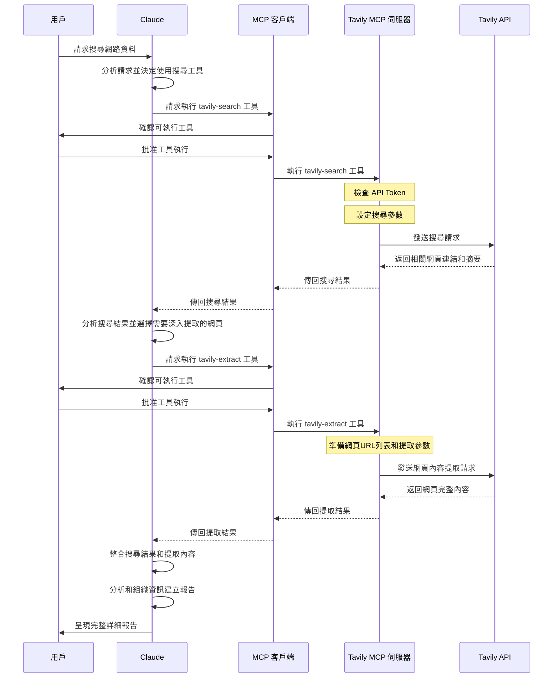

## 簡介

AI 助理若缺乏即時資訊，就像被困在知識孤島上的智者——學識淵博卻與現實脫節。Tavily MCP 技術突破了這一限制，為 Claude 等 AI 助理提供了探索網路世界的能力，讓它們能夠實時搜索、提取和處理網路資訊，進而提供更貼近現實的智能協助。無論是最新新聞、學術研究還是專業領域的變化，AI 助理都能輕鬆掌握，為您帶來真正有價值的對話體驗。

## 主要內容概覽與使用示例：

### tavily-search 搜尋功能

1. **一般網路搜尋**：搜尋全網的相關資訊
    
2. **新聞搜尋**：專門搜尋最新新聞
    
3. **特定網域搜尋**：限制在特定網站範圍內搜尋
    

#### 使用示例：

* 一般搜尋：「搜尋量子運算的最新發展」
    
* 新聞搜尋：「搜尋過去 7 天內關於 AI 初創企業的新聞文章」
    
* 特定網域搜尋：「在 nature.com 和 sciencedirect.com 上搜尋氣候變化研究」
    

### tavily-extract 內容提取功能

tavily-extract 工具能從指定網頁提取主要內容，過濾廣告、導航等非核心內容。

#### 使用示例：

* 提取文章：「從此連結提取主要內容：https://example.com/article」
    

### 組合使用案例

Tavily MCP 的強大之處在於可以組合使用搜尋和提取功能：

```plaintext
搜尋過去 7 天關於 AI 初創企業的新聞文章，並從每篇文章中提取主要內容，生成一份詳細報告。
```

## 使用範例


## 工作流程圖



## 為什麼要使用 Tavily API

Tavily API 從根本上被設計為服務 AI 應用，特別是大型語言模型。其返回的資料格式經過結構化處理，能夠直接被 AI 模型解析和理解，大幅降低了資料處理的複雜度。提供多種參數來控制搜尋行為，包括搜尋深度、包含或排除特定網域、限制結果數量等，讓開發者能夠根據應用需求精確調整搜尋結果。

### 註冊及獲取 API 金鑰的簡易步驟

1. **註冊帳號**：前往 [Tavily](https://app.tavily.com) 官網創建帳號
    
2. **獲取 API 金鑰**：登入後前往個人設定頁面獲取 API 金鑰
    
3. **儲值帳戶**：1000個點數內免費
    
4. **開始使用**：通過網頁界面或 API 開始使用 Tavily Search / Tavily Extract
    

#### API 點數計算方式

| 服務 | 使用類型 | 點數消耗 |
| --- | --- | --- |
| Tavily Search | 基本搜尋 | 每次查詢 1 點數 |
| Tavily Search | 進階搜尋 | 每次查詢 2 點數 |
| Tavily Extract | 基本擷取 | 每 5 個 URL 1 點數 |
| Tavily Extract | 進階擷取 | 每 5 個 URL 2 點數 |

## 前置需求

在開始使用 Tavily MCP 前，你需要準備以下項目：

* **Node.js**（版本 20 或更高）
    

## 安裝與設定步驟

### 使用 NPX 安裝

#### Windows

```powershell
set TAVILY_API_KEY=您的API金鑰
npx -y tavily-mcp@0.1.3
```

#### MacOS/Linux

```bash
export TAVILY_API_KEY=您的API金鑰
npx -y tavily-mcp@0.1.3
```

## **使用方式**

要在 Claude Desktop 中使用這個工具，你需要在設定中添加以下配置：

#### Windows

設定檔通常位於以下路徑：

```plaintext
C:\Users\[使用者名稱]\AppData\Roaming\Claude\claude_desktop_config.json
```

#### MacOS/Linux

設定檔通常位於以下路徑：

```plaintext
~/Library/Application Support/Claude/claude_desktop_config.json
```

### 設定方法

#### Windows/MacOS/Linux

```json
{
  "mcpServers": {
    "tavily-mcp": {
      "command": "npx",
      "args": ["-y", "tavily-mcp@0.1.3"],
      "env": {
        "TAVILY_API_KEY": "你的-API-金鑰"
      }
    }
  }
}
```

重啟 Claude Desktop

### 設定成功會出現以下內容


## 參考資料

[Tavily MCP 伺服器指南](https://github.com/tavily-ai/tavily-mcp)