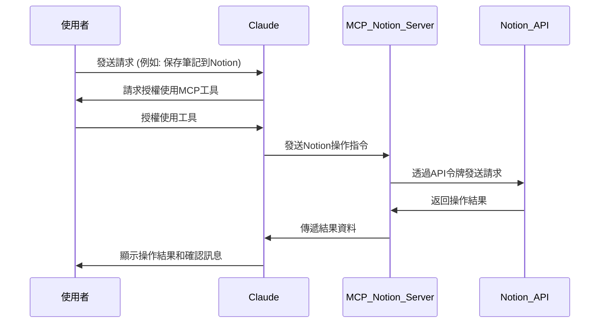

## 讓 Claude Desktop 直接操作 Notion 的頁面與資料庫

## 簡介

在數位工作環境中，Notion 已成為許多人管理知識和專案的核心工具。而 Claude 作為一款強大的 AI 助理，若能直接操作 Notion，將大幅提升工作效率。本文介紹 Notion MCP Server，一個能讓 Claude 與 Notion 工作區互動的橋樑工具。

## 核心功能

[suekou Notion MCP Server](https://github.com/suekou/mcp-notion-server) 是一個允許 Claude 與 Notion 工作區互動的中間件服務器。這個庫提供了 Notion API 的 MCP（Message Control Protocol）伺服器，讓 Claude 能夠讀取、更新、查詢和管理 Notion 頁面、資料庫及區塊內容。用戶需設置 Notion 整合並配置 Claude Desktop，即可讓 AI 助手直接操作 Notion 文檔和數據，實現智能化工作流程管理。

**溫馨提醒：** 社群伺服器**未經測試**，使用時請**自行承擔風險**。這些伺服器與 Anthropic 無關，也未獲得 Anthropic 的背書。

## 使用範例


## 工作流程圖



## 前置需求

在開始使用 Notion MCP 前，你需要準備以下項目：

* **Node.js**（版本 20 或更高）
    
* **Notion** 用戶
    

## 安裝與設定步驟

### 建立 Notion 整合應用

1. 前往 [Notion Your Integrations](https://www.notion.so/profile/integrations) 頁面
    
2. 點選「新整合 New Integration」建立新的整合應用
    
3. 為您的整合命名，並選擇適當的權限（例如「讀取內容 Read content」、「更新內容 Update content」、「插入內容 Update content」等）
    
4. 取得密鑰
    
5. 在 Notion 中開啟您希望整合應用能夠存取的頁面或資料庫, 點選右上角的「…」按鈕, 點選「連接 Connect to」按鈕並選擇您剛剛建立的整合應用
    

### **使用 NPX 安裝**

#### Windows/MacOS/Linux

```powershell
# 建立環境變數-使用者變數 NOTION_API_TOKEN
# NOTION_API_TOKEN="您的整合應用密鑰"
npx -y @suekou/mcp-notion-server
```

### 設定 [Claude Desktop](https://www.notion.so/my-integrations)

#### Windows

設定檔通常位於以下路徑：

```plaintext
C:\Users\[使用者名稱]\AppData\Roaming\Claude\claude_desktop_config.json
```

#### MacOS/Linux

設定檔通常位於以下路徑：

```plaintext
~/Library/Application Support/Claude/claude_desktop_config.json
```

### 設定方法

#### Windows/MacOS/Linux

```plaintext
{
  "mcpServers": {
    "notion": {
      "command": "npx",
      "args": ["-y", "@suekou/mcp-notion-server"],
      "env": {
        "NOTION_API_TOKEN": "您的整合應用密鑰"
      }
    }
  }
}
```

重啟 Claude Desktop

### 設定成功會出現以下內容


## Notion API 架構概觀

Notion API 主要操作分為以下幾個核心領域：

1. 區塊（Blocks）：Notion 中的基本內容單位
    
2. 頁面（Pages）：包含區塊的容器
    
3. 資料庫（Databases）：結構化資料的集合
    
4. 使用者（Users）：工作區中的成員
    
5. 註解（Comments）：對內容的回饋
    

### 區塊操作功能

區塊是 Notion 中的基本內容單位，可以是段落、標題、清單項目等多種類型。

| 功能名稱 | 說明 |
| --- | --- |
| `notion_retrieve_block` | 擷取特定區塊 |
| `notion_retrieve_block_children` | 擷取區塊的子項 |
| `notion_append_block_children` | 附加新子區塊到指定父區塊 |
| `notion_delete_block` | 刪除區塊 |

### 頁面操作功能

頁面是 Notion 中的主要容器，可以包含多種區塊和屬性。

| 功能名稱 | 說明 |
| --- | --- |
| `notion_retrieve_page` | 擷取頁面 |
| `notion_update_page_properties` | 更新頁面或資料庫項目的屬性 |

### 資料庫操作功能

資料庫是 Notion 中用於組織結構化資料的強大工具。

| 功能名稱 | 說明 |
| --- | --- |
| `notion_create_database` | 建立資料庫 |
| `notion_query_database` | 查詢資料庫 |
| `notion_retrieve_database` | 擷取資料庫 |
| `notion_update_database` | 更新資料庫 |
| `notion_create_database_item` | 在資料庫中建立新項目 |

### 搜尋功能

Notion API 提供強大的搜尋功能，可以快速找到頁面或資料庫。

| 功能名稱 | 說明 |
| --- | --- |
| `notion_search` | 按標題搜尋頁面或資料庫 |

### 使用者操作功能

Notion API 也提供了使用者相關操作，不過部分功能需要企業版權限。

| 功能名稱 | 說明 |
| --- | --- |
| `notion_list_all_users` | 列出工作區中的所有使用者 |
| `notion_retrieve_user` | 擷取特定使用者 |
| `notion_retrieve_bot_user` | 擷取與目前 token 關聯的機器人使用者 |

### 註解操作功能

註解功能讓使用者可以在 Notion 頁面中進行討論和回饋。

| 功能名稱 | 說明 |
| --- | --- |
| `notion_create_comment` | 建立註解 |
| `notion_retrieve_comments` | 擷取尚未解決的註解 |

## 參考資料

[suekou mcp-notion-server 伺服器指南](https://github.com/suekou/mcp-notion-server)